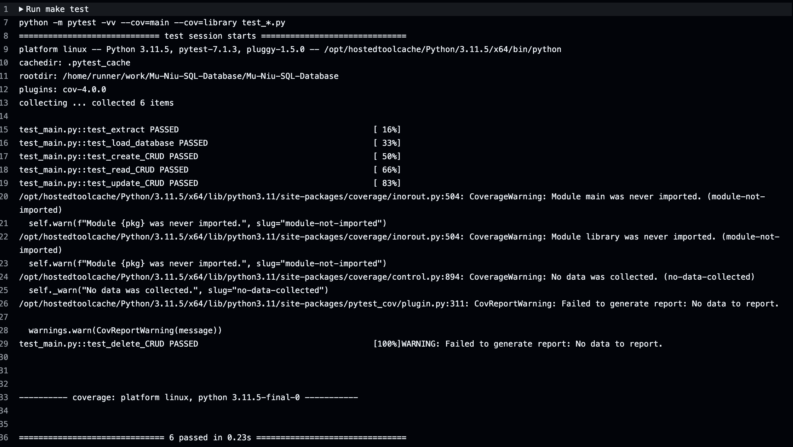
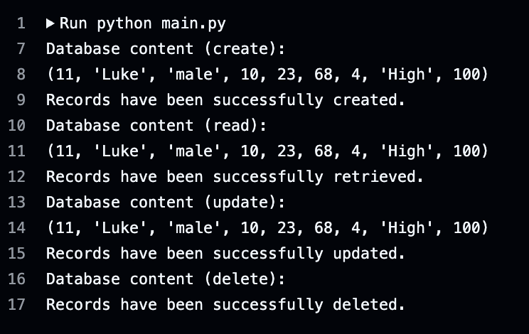

# Mu-Niu-SQL-Database

[](https://github.com/nogibjj/Mu-Niu-SQL-Database/actions/workflows/hello.yml)

This repository contains Python scripts and tools for interacting with an SQLite database, focusing on CRUD (Create, Read, Update, Delete) operations and data extraction from CSV files. The project demonstrates how to build and manage a SQLite database, load data into the database, and perform essential database manipulations using Python.

## Project Overview
This project revolves around creating, loading, and manipulating an SQLite database containing student performance data. The key functionalities include:
1. Extracting CSV data from a remote source.
2. Loading the extracted data into an SQLite database.
3. Performing basic database operations like creating, reading, updating, and deleting records.


### CRUD Operations

1. Create
```python
from query import create_CRUD

data = (11, "Luke", "male", 10, 23, 68, 4, "High", 100)
create_CRUD("student_performance_DB.db", data)
```


2. Read

```python
from query import read_CRUD

read_CRUD("student_performance_DB.db")
```


3. Update

```python
from query import update_CRUD

new_data = (12, "Johnny", "Male", 80, 70, 70, 1, "Super High", 100)
update_CRUD("student_performance_DB.db", 1, new_data)
```


4. Delete

```python
from query import delete_CRUD

delete_CRUD("student_performance_DB.db", 11)
```

#### Successful Database Operations



